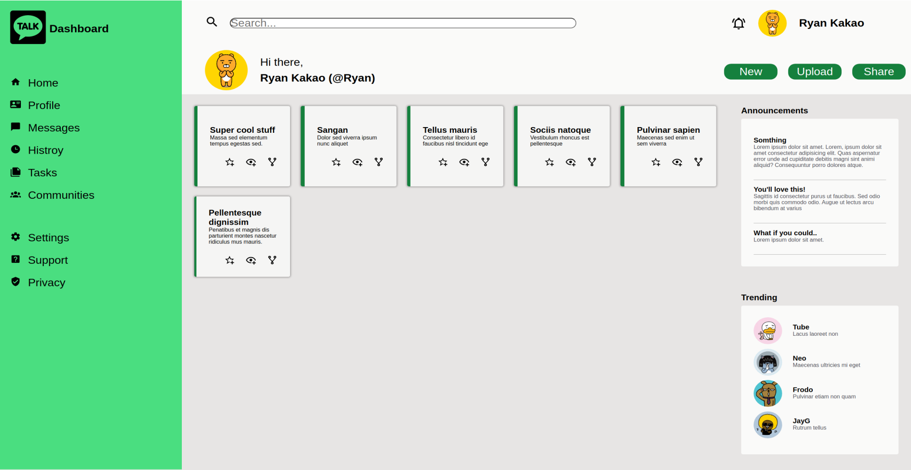

# admin-dashboard



# Admin Dashboard

Welcome to the Admin Dashboard project! This project is designed to create a clean and intuitive admin dashboard using Flexbox and Grid layouts. It features a variety of icons to enhance the user interface and experience.

## Overview

The Admin Dashboard is a web application designed for managing and monitoring various aspects of your system or application. It provides a user-friendly interface with responsive design and a range of features to make administrative tasks efficient and enjoyable.

## Features

- **Responsive Design**: The dashboard is designed to work seamlessly on a wide range of devices, from desktop screens to mobile phones.

- **Flexbox and Grid Layout**: We use Flexbox and Grid layout techniques to create a visually appealing and organized dashboard interface.

- **Icon Library**: The project includes an extensive collection of icons to enhance the visual representation of data and actions.

## Getting Started

To start using the Admin Dashboard, follow these steps:

1. **Clone the Repository**: Clone this repository to your local machine using the following command:

   ```shell
   git clone https://github.com/your-username/admin-dashboard.git
